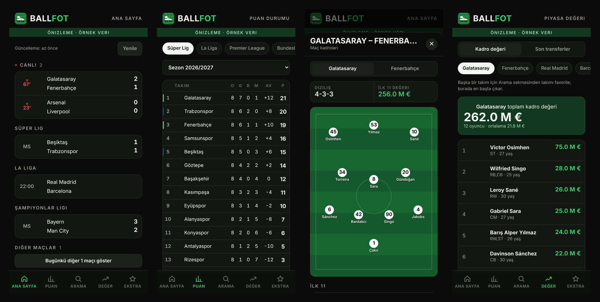

<p align="center"></p>
<h1 align="center">BallFot</h1>
<p align="center">Canlı skor, puan durumu, kadrolar ve piyasa değerleri için sekmeli futbol uygulaması.</p>



<sub>Ekran görüntüleri örnek veriyle alınmıştır.</sub>

## Özellikler

| Sekme | İçerik |
| --- | --- |
| **Ana Sayfa** | Canlı maçlar, favori takımların maçları, liglere göre günün programı. Maça dokununca diziliş, saha üstünde ilk 11, yedekler ve forma giyemeyecekler. |
| **Puan** | Süper Lig, La Liga, Premier League, Bundesliga, Serie A, Ligue 1, Şampiyonlar Ligi ve Avrupa Ligi puan durumu; sezon kutusu ve gol krallığı. |
| **Arama** | Oyuncu ve takım araması. Oyuncuda boy, yaş, ayak, sözleşme bitişi ve piyasa değeri; takımda mevkilere göre kadro. |
| **Değer** | Takımın toplam kadro değeri ve oyuncu sıralaması, son transferler. |
| **Ekstra** | Favoriler, gündemdeki haberler, API kullanımı ve anahtar ayarı. |

Takım ve oyuncular yıldızla favorilenir; favoriler Ekstra sekmesinin en üstünde görünür.

## API anahtarı

Veriler RapidAPI üzerindeki [Free API Live Football Data](https://rapidapi.com/Creativesdev/api/free-api-live-football-data) servisinden gelir.

**Bu depoda API anahtarı yoktur.** Uygulama ilk açılışta anahtarı sorar ve yalnızca o cihazda saklar. Kendi anahtarını almak için:

1. RapidAPI'de hesap aç ve yukarıdaki API'ye abone ol (ücretsiz plan yeterli).
2. API sayfasındaki kod örneğinde `x-rapidapi-key` değerini kopyala.
3. BallFot'u aç, anahtarı yapıştır ve kaydet.

Anahtar daha sonra Ekstra sekmesinden değiştirilebilir.

### İstek sınırı

Ücretsiz planda ayda 100 istek hakkı var. Uygulama bu yüzden:

- Yanıtları cihazda saklar; aynı ekran yeniden açıldığında yeni istek harcamaz.
- Kendiliğinden yenileme yapmaz; canlı skor "Yenile"ye basınca güncellenir.
- Kalan hakkı Ekstra sekmesinde gösterir.

## Çalıştırma

Uygulamanın tamamı tek dosyadır: `index.html`. Tarayıcıda açman yeterli; kurulum ya da derleme adımı yok.

### Android APK

`android/` klasörü, `index.html` dosyasını bir WebView içinde açan küçük bir Android kabuğudur. Gradle kullanmaz.

Gerekenler: JDK 17+, Android SDK (`platforms;android-34` ve `build-tools`).

```bash
export ANDROID_HOME=~/Android/Sdk
cd android
./build.sh
```

Çıktı `android/out/BallFot.apk` olur ve varsayılan olarak hata ayıklama (debug) anahtarıyla imzalanır. Kendi anahtarınla imzalamak için `KEYSTORE` ve `KEYSTORE_PASS` değişkenlerini ver.

## Klasör yapısı

```
BallFot/
├── index.html            Uygulamanın tamamı (arayüz + mantık)
├── android/
│   ├── AndroidManifest.xml
│   ├── build.sh          APK derleme betiği
│   ├── res/              Simge ve tema
│   └── src/              MainActivity (WebView kabuğu)
└── docs/                 Simge ve ekran görüntüleri
```

## Bilinen sınırlar

- API yalnızca güncel sezonun puan durumunu veriyor; geçmiş sezonlar seçilince uygulama bunu bildirir.
- Kupa ve milli maçlarda API lig adını göndermediği için bu maçlar "Diğer maçlar" başlığı altında listelenir.
- Maç detayında kadro ve diziliş var; gol, kart ve istatistik akışı yok.

## Teknik notlar

- Tek dosya, çatı (framework) ve derleme aracı yok; düz HTML, CSS ve JavaScript.
- Anahtar, favoriler ve önbellek `localStorage` içinde tutulur.
- Takım logoları ve oyuncu fotoğrafları FotMob görsel sunucusundan yüklenir.
